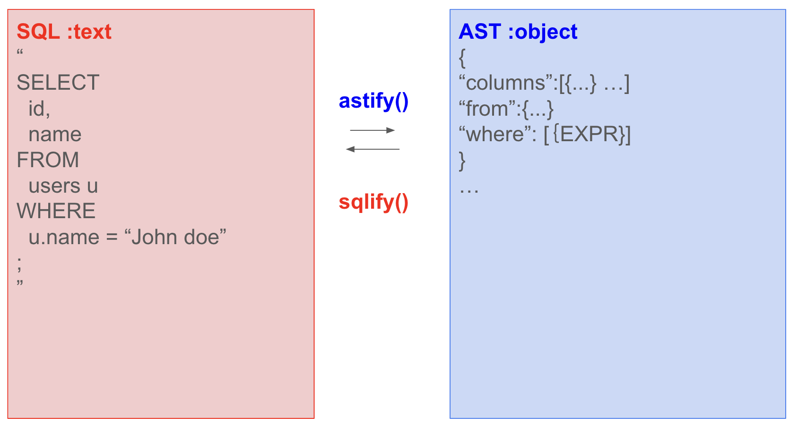

# Nodejs SQL Parser

Nodejs SQL Parser provides an API to parse SQL into JS Object as an Abstruct Syntax Tree(AST) and vice versa. The object also support syntax types through Typescript.

## *IMPORTANT*
this is private forked repository from [original library](https://github.com/zaramme/node-sql-parser/blob/master/docs/~README.md), for practice of technical documantation module.


I have used this OSS library in my side project to parse SQL on datalake platform. it exactly provides everything I need; however its documentation and source code comments are insufficient. I spent a lot of time digging into the code to understand the data structure and to find right method to use in specific perpose.
To inprovement this, my goal for documentation is to provide general information about the data structure and practical usage of the API acooding to some usecase, making it easier for users how to use this library effectively.

## Features
  - support select, delete, update and insert type
  - support drop, truncate and rename command
  - support multiple sql statement seperate by semicolon
  - output the table and column list that the sql visited with the corresponding authority
  - support various databases engine
    - Athena
    - BigQuery
    - DB2
    - Hive
    - MariaDB
    - MySQL
    - PostgresQL
    - Redshift
    - Sqlite
    - TransactSQL
    - [FlinkSQL](https://ci.apache.org/projects/flink/flink-docs-stable/dev/table/sql/)
    - Snowflake(alpha)
    - [Noql](https://noql.synatic.dev/)
    - New issue could be made for other new database.

# installation

### From [npmjs](https://www.npmjs.org/)

```bash
npm install node-sql-parser --save

or

yarn add node-sql-parser
```

### From [GitHub Package Registry](https://npm.pkg.github.com/)

```bash
npm install @taozhi8833998/node-sql-parser --registry=https://npm.pkg.github.com/
```

## basic usage

you can simply use `Parser.astify()` and `Parser.sqlify()` to interconversion SQL as text  and AST as object.

for more information about AST, please see [API & Type referrence](./docs/api.md)
.



here's sample code to parse sql and operate it.

```
import { Parser, AST } from 'node-sql-parser'

main(sql:string) {
  const parser = new Parser()

  // parse sql into SQL
  const ast = Parser.astify(sql) // select id, name from users;
  console.log(ast)
  /*
    {
      “columns”:[{...} ],
      “from”:{...},
      “where”: [{}...]
    }
  */

  // add columns in SELECT statement
  ast.columns.push({
    expr: {
      type: 'column_ref',
      table: null,
      column: 'email'
    },
    as: null
  })

  // convert SQL again
  console.log(ast.sqlify(ast)) // select id, name, *email* from users;
}
```

## API & Type Reference

-> [API & Type referrence](./docs/api.md)